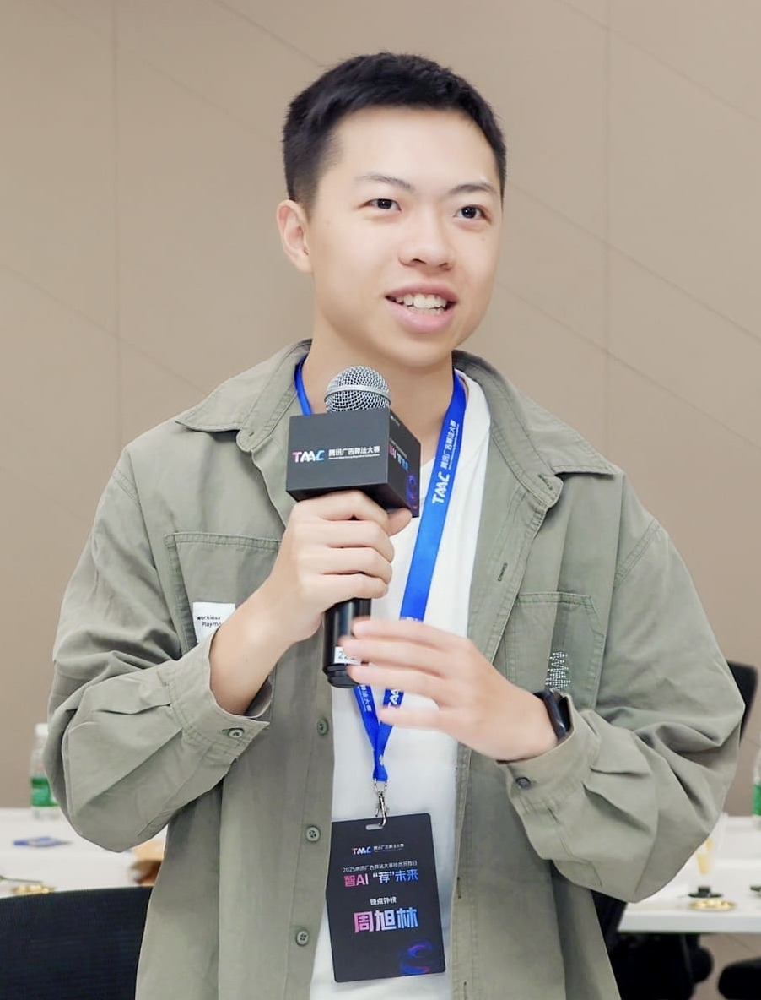

# About Me

My name is Xulin Zhou(周旭林), a graduate student at [Institute of Software, Chinese Academy of Sciences(ISCAS)](http://www.is.cas.cn/) in Beijing. I graduated from [Jinan University](https://www.jnu.edu.cn/main.htm)  with a bachelor's degree in 2023. I was born and bred in Dongguan.

**My research interests lie in *Parallel Computing and Compiler Optimization***. I have served as a maintainer and contributor to several open-source compiler projects. See my personal statement [here](/projects/PS.md).

**Writing is my long-standing habit.** I have been keeping a diary since high school. Parts of the diaries are organized as [several columns](/blogs/main.md) to summarize miscellaneous insights from my experiences and reading. 

Living in the city, I like taking photos to record urban life and organize them into [street photography works](/photography/2022-cities/main.md). When I am outdoors, I like [trekking](photography/2024-wusun/main.md) because I can experience different possibilities of life.
<!-- 
See my annual summary of 2025 [here](/blogs/2025-summary/2025-summary.md). -->
