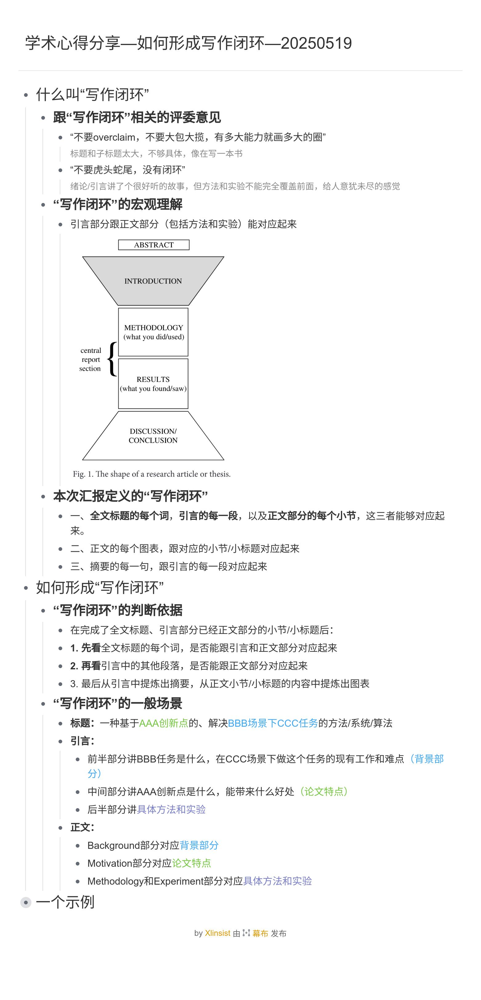

# 学术写作心得

## 写在前面

研究生期间接触到了专利、基金/开题报告、毕业论文等文书的写作。在我看来，研究成果的书面表达，就是按顺序由浅入深地经历了（一）拿具体成果写专利、（二）为成果撰写基金/开题报告、（三）整理成毕业论文、（四）总结成简历和研究陈述这些流程。

这是因为，写专利->写基金/开题报告->整理成毕业论文的过程，分别对应完成一篇论文的方法和实验部分->背景和动机部分->引言部分。在这个过程中，思考方式经历了从描述具体成果、确定研究方向到准备汇报演讲这样由具体到抽象、由面向技术到面向观众的转变。

## 拿具体成果写专利

专利（特指发明专利，是一项发明描述书）是：与现有工作相比，有non-trivial的独特之处，使得性能指标有提升的一套方法论。
- 介绍现有工作相当于介绍领域背景、要解决的任务和当前挑战（反映为某个性能指标不够好），呈现作为对照组的方法论。
- 介绍独特之处相当于介绍改进的动机和核心思想（表明这是non-trivial的），呈现作为实验组的方法论，量化它相比对照组能带来的性能指标提升。
- 这套方法论具体采用什么技术路线、怎么写代码实现、怎么设计实验验证等可以很开放（它们只是方法论的一种实例化），只要能支持现有工作和独特之处的论述即可。

| 专利的例子            | 名称                         | 现有工作                                                      | 独特之处                    | 怎么个non-trivial法                                                                       | 性能提升效果                                                       |
| ---------------- | -------------------------- | --------------------------------------------------------- | ----------------------- | ------------------------------------------------------------------------------------- | ------------------------------------------------------------ |
| 生活中的比喻           | 《高效多功能厨房削皮刀》               | 当前方法分别用刀削皮、用刨丝器刨丝。当前挑战是处理一顿饭需要频繁更换工具，备餐效率指标低下，且工具收纳占用空间大。 | 将刨丝的刀刃与削皮的刀刀刃巧妙结合在一把刀上。 | 并非简单地把两个工具绑在一起（那是trivial的），而是重新设计了力传导结构（有结构创新），使得无论使用哪种功能，使用者的握持和发力方式都符合人体工学，保证效率和安全。 | 1. 备餐效率提升约20%（减少工具更换和寻找时间）。    2. 空间占用减少50%（一把工具取代两把）。 |

## 为成果撰写基金/开题报告

基金、开题报告等本质上是项目申请书，需要讲明白为什么要做一个项目（即立项依据），打算怎么开展（即研究路线）。
- 立项依据就是领域背景、要解决的任务和当前挑战（跟专利强调最相关的现有工作相比，基金强调有充分文献支持的国内外研究现状）。
- 研究路线就是针对当前挑战，提出框架级总体研究目标（跟专利一样要体现出独特之处），下面分模块级研究内容，它们采用工具级技术路线实现。
- 从立项依据到研究路线、从研究路线里的宏观级别到微观级别的逻辑，以及研究路线里同级别的关系，要高度统一。

| 基金的例子            | 背景                                                                                         | 要解决的任务             | 当前挑战                                                                                                                                                                                             | 研究目标                   | 研究内容                                             | 技术路线                                                           |
| ---------------- | ------------------------------------------------------------------------------------------ | ------------------ | ------------------------------------------------------------------------------------------------------------------------------------------------------------------------------------------------ | ---------------------- | ------------------------------------------------ | -------------------------------------------------------------- |
| 专业内的例子（仅作写作逻辑参考） | 1. 开源是发展自主可控芯片的创新路径。  2. 芯片技术栈的关键是指令集架构。  3. RISC-V指令集架构的开源生态值得借鉴。    | 如何软硬件协同构建开源生态？  | 研究现状：英伟达GPU和CUDA生态做得很好。国内虽然有相关工作，但还没有能扳手腕的产品。主要是开源生态很难做出来。  核心观察：RISC-V向量处理器和GPGPU处理器的指令集架构和编程模型有共通之处： 1. 在指令集架构上，GPGPU处理器可以借鉴RISC-V的设计，复用其开源生态。  2. 在编程模型上，开源OpenCL与闭源CUDA有一战之力。 | 《基于RISC-V的开源GPGPU平台建设》 | 1. 开源指令集架构  2. 开源编程框架和工具链  3. 开源硬件实现 | 1. RISC-V GPU指令集架构  2. OpenCL并行编程框架  3. 自研GPGPU微架构 |
| 生活中的比喻           | 身体是革命的本钱，保持身体健康很重要。                                                                        | 如何锻炼好身体？           | 现代上班族白天很忙，晚上还要加班，需要见缝插针地锻炼。                                                                                                                                                                      | 《适合上班族的锻炼方式》           | 1. 午饭时间去打球  2. 晚饭时间去跑步                     | 1. 先打球，再错峰吃饭，吃完饭回去午休  2. 去外面跑步，顺便打包盒饭回来，不耽误晚上加班。        |

## 整理成毕业论文

### 取标题的艺术

| 标题种类            | 要点                       | 标题示例      |
| --------------- | ----------------------------------- | --------- |
| 新方法完成旧任务 | 为啥旧方法不够好，为啥新方法有望解决（跟写专利很像）          | 《基于XXX方法的XXX任务研究》 |
| 旧方法用在新场景上       | 新场景有什么特殊性，这个特殊性导致直接用旧方法会有哪些挑战，怎么解决的 | 《面向XXX场景的XXX方法研究》 |
| 提出一个总体研究目标  | 为什么要研究这个，包括哪些研究内容，它们之间有什么关系（跟写基金很像）     |**《Scalable and Intelligent Learning Systems》，Tianqi Chen，2019**  |
| 前沿方法论的实践经验      | 科普这个方法论，讲如何在这个方法论下做相关实践            | **《Deep Learning for Compilers》，Chris Cummins，2020**  |

上面四个标题种类中，前两个常见于硕士论文（要专而精，避免像一本书的标题），后两个给的示例都是博士论文（要提炼出共性）。

### 形成写作闭环

写作思路的闭环，是指标题、摘要、引言、正文小标题和图表等文章部分能互相对应起来。

### 撰写论文

- [ ] 确定面向场景、目标任务和指标、实验平台、依赖方法、baseline和SOTA、自己的创新点，从而定好大标题
- [ ] 定好章节标题
- [ ] 定好每段的内容大意，围绕什么图表
- [ ] GPT润色，形成完整段落
- [ ] 排版，要求排版完后页数能凑够
- [ ] intro，把性能差距反映成可见风险
- [ ] 润色正文，每个地方反反复复穿插着提自己的创新点

### 制作PPT

原则：1 从标题开始到每个段落都要形成闭环；2 把逻辑讲清楚，而不是只罗列关键词。
- [ ] PPT风格要规整，字少，每页PPT只需突出一句话的takeaway和与上一页的联系；不重要的部分如目录排布等直接参考同门怎么做你就怎么做。
- [ ] 选题背景要把概念讲清楚，包括要解决的任务和依托的方法。
- [ ] 存在问题关注有哪几个，每一个对应本文工作的一个贡献点；通过实验数据和直观图表来揭示这个问题及导致的性能后果。
- [ ] 研究现状关注分成了哪几类，跟本文工作最相关的是哪类，用发展历程串起来；每类最后给个优缺点的总结。
- [ ] 研究内容关注动机（哪里需要改）->预实验数据得出结论（不改的话性能上不去）->启发（可以这么改，理论分析这么改是有效的）->方法（具体怎么改）->实验验证方法效果（这么改真的有用，提升可量化）。方法部分要说算法有算法图，说框架有框架图。
- [ ] 实验设置中，优化对象，比较方法，评估指标，实验平台都要解释清楚。

### 答辩自检清单

> 听了三天师兄师姐们毕业答辩，梳理了答辩过程中评委一般会问的问题。核心是要让评委很容易听明白你的工作。

**论文立意**（工作有意义）

- [ ]  研究问题能用一句话说明在什么场景下解决什么（输入什么，输出什么），提升了什么指标
- [ ]  研究意义/关键挑战能让外行人一看就懂（通过小例子或描绘应用前景），知道选定的场景跟其他场景相比有什么突出的难点、特殊性和研究价值
- [ ]  研究现状讲现在解决到什么程度（是现有方法在某个阶段难以自动化，还是SOTA性能仍达不到某个阈值）
- [ ]  研究内容应具体、量化、可拓展；不要有歧义，不要看起来大包大揽结果虎头蛇尾没有闭环（有多大能力就画多大的圈）。最好是能给个case study
- [ ]  全文研究框架涵盖主要问题-研究内容-创新点。各个层级间也要有关系，创新点要看起来non trivial
- [ ]  避免与行业常识（比如智能驾驶的已有技术）和大众认识（比如对智能面试系统的设想）冲突

**方法与实验** （解法有效果）

- [ ]  你的创新点及你的工作跟其他工作的区别（改了什么），为什么需要这个创新点（为什么要改），它怎么解决你的问题（怎么用起来），你的方法产生了什么技术效果（有你没你有什么区别），你怎么证明你的方法有效（怎么测试的）
- [ ]  重点讲改了什么，对于用别人的和不相关的就说人家怎么做我们也怎么做就好，不用也罗列一遍。最好是能用对比图表突出我们基于已有工作所改进的地方。
- [ ]  为什么要改，而不是直接用其他场景的方法（比如做的是序列化的工作，那非序列化的方法可以在这里用吗），为什么这个方法不能泛化到其他领域（比如做的riscv的，可以借鉴到其他架构上吗）
- [ ]  怎么用起来，里面的超参数和规则怎么设计，最好是能给个示意图（包括case study图，和整体框架图）
- [ ]  有我们的方法能获得什么好处，能用常识去理解这个技术效果提升的量化程度，最好有个demo表示人家不能做我们能做
- [ ]  怎么测试的，评价指标是这类方法（比如数据集构造）所通用的评价指标嘛，选择对比的baseline是领域SOTA嘛，是要逼近它们（比如对于编译优化逼近手工调优）还是能完全超过它们
- [ ]  对于自己的规则设计，该有的消融实验要有做，以保证自己的实验有效果
- [ ]  对于做出的简化和假设，要么说其他工作也是这么做的，要么说这个多大程度上也能有效，不然会很麻烦

**内容规范** （写作有调理）

- [ ]  论文的大标题，要新颖且包含创新点，而不只是罗列用到的技术。比如若论文题目为《一种面向RISC-V的多级编译优化方法》，则论述里应突出的是我们能打通端到端通路而别人的没打通，不应该只是强调我们如何将多级编译用在RISC-V平台上
- [ ]  论文里的小标题，要让评委看一眼就知道说什么，脱离论文的背景也能相对独立，不要太大
- [ ]  论文里的图，要让评委看一眼就知道说什么，图注要规范，横轴纵轴的标注要符合正常思维
- [ ]  论文里的目录，要让评委看一眼就知道这是合适的，包括章节之间有什么关联，主要问题、研究内容、创新点要互相有逻辑，不要有病句
- [ ]  论文里提到的性能提升，要让评委看一眼就知道是指什么方面的性能提升，跟什么相比，这个程度的提升的量级是多少，能得出什么结论
- [ ]  论文的整体排布，多放图和表格做提炼，每块文字都能很容易跟上下文的图表联系在一起
- [ ]  论文的成果如果能形成demo挂个github链接那最好
- [ ]  写作中回避容易引起评委产生不必要质疑的点，适当用通俗近似的表达来取代精确但拗口的描述

**术语规范** （用词够严谨）

- [ ]  数据规模说明：量化描述需包含参照系（如"测试50台物联网设备"这50台对应现实中的多大规模）
- [ ]  术语使用的原则：领域通用术语直接使用，避免再花额外篇幅去解释 ；自创术语需要显式且详细地描述清楚
- [ ]  其它非必要的场合不引入术语。因为术语的使用会让评委产生问题，举例来说，当文章里提到了"启发式"，评委就会想知道：（1）启发式的规则长什么样子；（2），它是怎么降低搜索开销的，不用启发式原先会有多少搜索开销；（3）启发式得到的近似在多大程度上接近最优解...要确保这些问题在论文中有涉及回答。类似的，文章中提到"算法"评委就会去找伪代码在哪里；提到"知识库"评委就会去找规则集合描述；提到"大模型"评委就会关心指的是否是prompt工程，会不会用到零样本或少样本提示等；提到“搭建一个系统”评委就会去找这个系统的框架图和用例分析等
- [ ]  写作中减少出现正确但跟文章关系不大的句子段落

## 写简历和研究陈述

简历中的项目经历有两种写法：
1. 突出技术栈的写法，常见于工程项目和日常业务，比如软件的新平台适配和增量支持：我对什么项目做了贡献，我具体做了什么和用到的技术栈，做这个的意义/成就有多大。
2. 突出创新点的写法，常见于科研项目和自己的代表作，比如从零到一搭建了某个框架：什么场景下的性能不能让人满意，根因在哪里，需要改什么才能提升性能，为什么这么改是有效的，量化性能提升。

研究陈述中的研究兴趣的常见递进逻辑如下：
1. My research interests lie broadly on 大领域，with a specific focus on 小领域。
2. Specifically, my work aims to 具体做什么 / Rather than merely focusing on ..., I specifically 关注研究中某个特点。
3. My research has pioneered several important topics in 实际应用。
